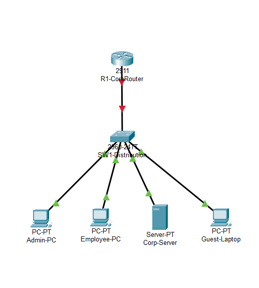
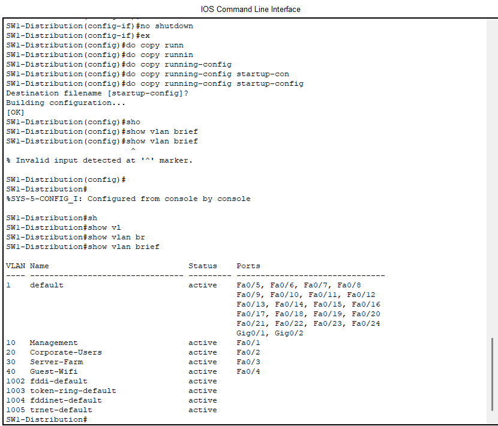
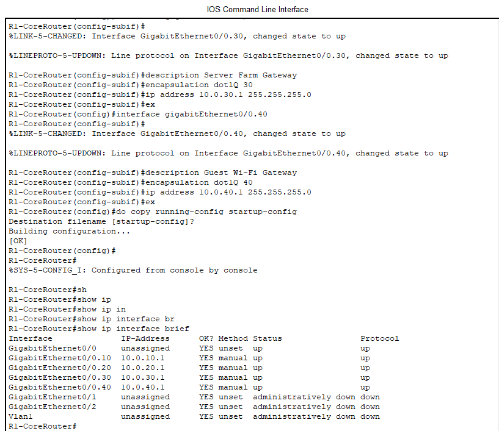
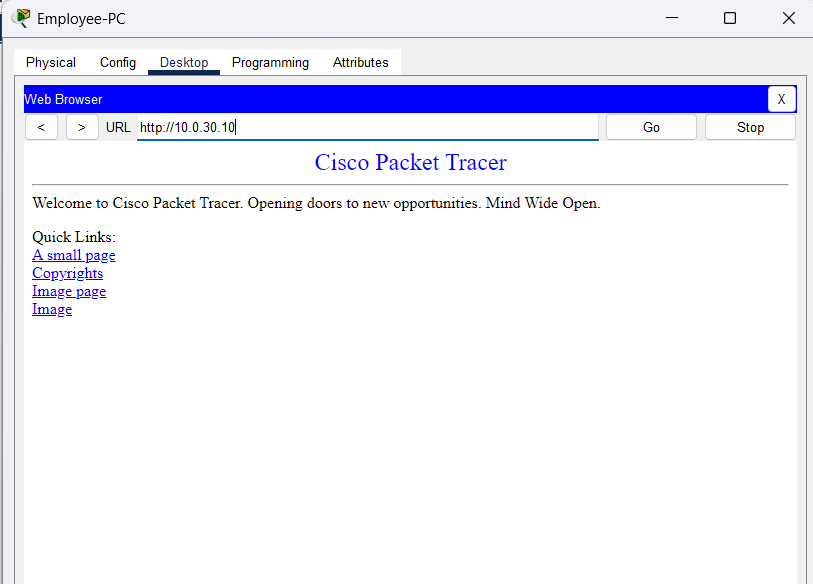
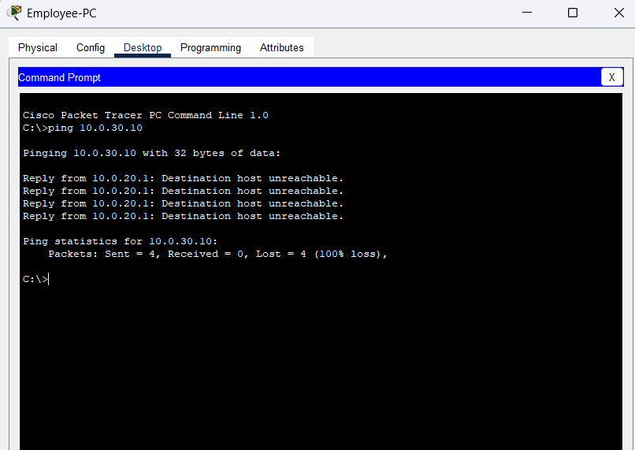
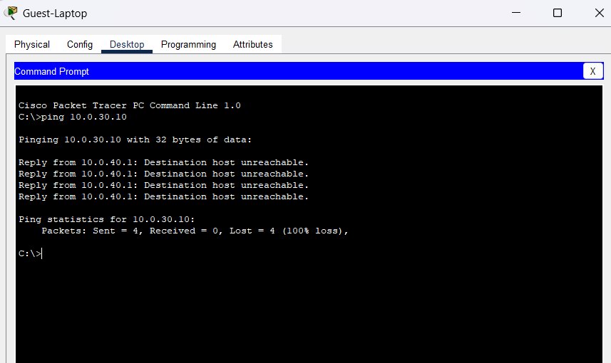
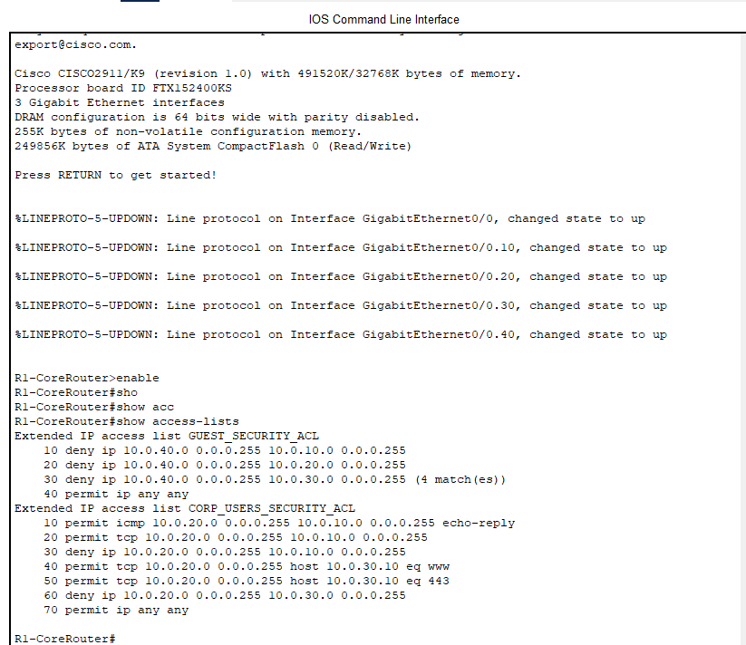

# Enterprise Cisco Multi-VLAN Segmentation, Router-on-a-Stick & Zero-Trust Security ACLs

[](https://www.cisco.com/)
[](https://en.wikipedia.org/wiki/IEEE_802.1Q)
[](https://www.cisco.com/)
[](https://skillsforall.com/)
[](https://github.com/ChukwubuzorPerazim)

---

## 1. Executive Summary & Problem Statement

In unsegmented (flat) corporate networks, all endpoints share a single broadcast domain. A security breach on an unmonitored guest endpoint or a compromised workstation permits unrestricted lateral movement, enabling threat actors to directly probe and exploit mission-critical servers, administrative management planes, and enterprise databases.

This project implements an enterprise **Zero-Trust Network Segmentation architecture** using **Cisco 2911 Integrated Services Routers (ISR)** and a **Cisco Catalyst 2960 24-Port Switch**. By establishing isolated **Virtual Local Area Networks (VLANs)**, multiplexed **802.1Q trunking (Router-on-a-Stick)**, and granular **Extended Access Control Lists (ACLs)**, this architecture isolates untrusted guest devices, restricts employee traffic strictly to authorized application ports (HTTP/HTTPS), and isolates infrastructure management.

### Key Objectives Accomplished:
* **Multi-VLAN Isolation:** Designed and configured 4 distinct security zones (`Management`, `Corporate-Users`, `Server-Farm`, `Guest-WiFi`).
* **Layer 2 Access & Trunk Configuration:** Configured access ports `Fa0/1` through `Fa0/4` with Spanning-Tree PortFast, and established an IEEE 802.1Q trunk link (`Gig0/1`) carrying designated VLAN traffic.
* **Layer 3 Inter-VLAN Routing (Router-on-a-Stick):** Partitioned physical interface `Gig0/0` into 4 logical subinterfaces with dedicated default gateway addressing (`Gig0/0.10`, `Gig0/0.20`, `Gig0/0.30`, `Gig0/0.40`).
* **Zero-Trust Extended ACLs:** Implemented directional packet filtering denying guest lateral movement, restricting user access to server HTTP/HTTPS (ports 80/443), and blocking unauthorized ICMP and administrative probing.
* **Traffic Validation & Match Telemetry:** Validated directional policy enforcement via simulated web browsing, ICMP drop verification, and router ACL packet match counters.

---

## 2. Network Topology & Addressing Architecture

```
                                  +-----------------------+
                                  |     R1-CoreRouter     |
                                  |      Cisco 2911       |
                                  +-----------+-----------+
                                              | Gig0/0 (802.1Q Trunk)
                                              | Subinterfaces: .10, .20, .30, .40
                                              |
                                  +-----------+-----------+
                                  |    SW1-Distribution   |
                                  |   Cisco 2960 (24-Port)|
                                  +----+-----+-----+-----+
                                       |     |     |     |
              +------------------------+     |     |     +-------------------------+
        Fa0/1 |                        Fa0/2 |     | Fa0/3                          Fa0/4 |
              v                              v     v                                      v
       +--------------+     +--------------+   +--------------+             +--------------+
       |   Admin-PC   |     |  Employee-PC |   |  Corp-Server |             | Guest-Laptop |
       |   VLAN 10    |     |   VLAN 20    |   |   VLAN 30    |             |   VLAN 40    |
       |  Management  |     |  Corp Users  |   | Server Farm  |             |  Guest Wi-Fi |
       | 10.0.10.10   |     | 10.0.20.10   |   | 10.0.30.10   |             | 10.0.40.10   |
       +--------------+     +--------------+   +--------------+             +--------------+
```

### Subnetting & Security Zone Matrix

| VLAN ID | VLAN Name | Security Zone | Subnet | Gateway IP | Switch Port | Test Endpoint | Assigned IP |
| :--- | :--- | :--- | :--- | :--- | :--- | :--- | :--- |
| **VLAN 10** | `Management` | High Trust (Admins) | `10.0.10.0/24` | `10.0.10.1` | `Fa0/1` | `Admin-PC` | `10.0.10.10` |
| **VLAN 20** | `Corporate-Users` | Medium Trust (Staff) | `10.0.20.0/24` | `10.0.20.1` | `Fa0/2` | `Employee-PC` | `10.0.20.10` |
| **VLAN 30** | `Server-Farm` | Protected Infrastructure | `10.0.30.0/24` | `10.0.30.1` | `Fa0/3` | `Corp-Server` | `10.0.30.10` |
| **VLAN 40** | `Guest-WiFi` | Zero Trust (Untrusted) | `10.0.40.0/24` | `10.0.40.1` | `Fa0/4` | `Guest-Laptop` | `10.0.40.10` |

---

## 3. Implementation Walkthrough

### Phase 1: Catalyst Switch Configuration (`SW1-Distribution`)
1. Defined enterprise VLANs:
   ```cisco
   vlan 10
    name Management
   vlan 20
    name Corporate-Users
   vlan 30
    name Server-Farm
   vlan 40
    name Guest-WiFi
   ```
2. Assigned access ports within physical 24-port chassis constraints and enabled Spanning-Tree PortFast for instantaneous edge forwarding:
   ```cisco
   interface FastEthernet0/1
    switchport mode access
    switchport access vlan 10
    spanning-tree portfast
   interface FastEthernet0/2
    switchport mode access
    switchport access vlan 20
    spanning-tree portfast
   interface FastEthernet0/3
    switchport mode access
    switchport access vlan 30
    spanning-tree portfast
   interface FastEthernet0/4
    switchport mode access
    switchport access vlan 40
    spanning-tree portfast
   ```
3. Configured uplink port `Gig0/1` as an 802.1Q trunk link to carry all segmented traffic to the core router:
   ```cisco
   interface GigabitEthernet0/1
    switchport mode trunk
    switchport trunk allowed vlan 10,20,30,40
   ```

### Phase 2: Router-on-a-Stick Configuration (`R1-CoreRouter`)
Configured IEEE 802.1Q subinterfaces on physical interface `Gig0/0`, establishing gateway endpoints for each broadcast domain:
```cisco
interface GigabitEthernet0/0
 no shutdown

interface GigabitEthernet0/0.10
 encapsulation dot1Q 10
 ip address 10.0.10.1 255.255.255.0

interface GigabitEthernet0/0.20
 encapsulation dot1Q 20
 ip address 10.0.20.1 255.255.255.0

interface GigabitEthernet0/0.30
 encapsulation dot1Q 30
 ip address 10.0.30.1 255.255.255.0

interface GigabitEthernet0/0.40
 encapsulation dot1Q 40
 ip address 10.0.40.1 255.255.255.0
```

### Phase 3: Zero-Trust Extended Security ACL Deployment
Engineered directional packet-filtering policies applied inbound at the router subinterfaces:

1. **Guest Wi-Fi Isolation (`GUEST_SECURITY_ACL`):**
   ```cisco
   ip access-list extended GUEST_SECURITY_ACL
    10 deny ip 10.0.40.0 0.0.0.255 10.0.10.0 0.0.0.255
    20 deny ip 10.0.40.0 0.0.0.255 10.0.20.0 0.0.0.255
    30 deny ip 10.0.40.0 0.0.0.255 10.0.30.0 0.0.0.255
    40 permit ip any any
   ```
2. **Corporate Users Least Privilege & Stateful Return (`CORP_USERS_SECURITY_ACL`):**
   ```cisco
   ip access-list extended CORP_USERS_SECURITY_ACL
    10 permit icmp 10.0.20.0 0.0.0.255 10.0.10.0 0.0.0.255 echo-reply
    20 permit tcp 10.0.20.0 0.0.0.255 10.0.10.0 0.0.0.255 established
    30 deny ip 10.0.20.0 0.0.0.255 10.0.10.0 0.0.0.255
    40 permit tcp 10.0.20.0 0.0.0.255 host 10.0.30.10 eq 80
    50 permit tcp 10.0.20.0 0.0.0.255 host 10.0.30.10 eq 443
    60 deny ip 10.0.20.0 0.0.0.255 10.0.30.0 0.0.0.255
    70 permit ip any any
   ```
3. **Interface Binding:**
   ```cisco
   interface GigabitEthernet0/0.40
    ip access-group GUEST_SECURITY_ACL in
   interface GigabitEthernet0/0.20
    ip access-group CORP_USERS_SECURITY_ACL in
   ```

---

## 4. Verification & Testing Evidence

All tests below were executed and captured directly from the live Cisco Packet Tracer lab environment.

### Test 1: Complete Network Topology Overview


*Figure 1: Cisco Packet Tracer workspace displaying core router (R1-CoreRouter), distribution switch (SW1-Distribution), and all 4 VLAN endpoint zones.*

---

### Test 2: Switch Layer 2 VLAN Database Status
Verified operational VLAN mapping on `SW1-Distribution`:

```cisco
SW1-Distribution# show vlan brief

VLAN Name                             Status    Ports
---- -------------------------------- --------- -------------------------------
1    default                          active    Fa0/5, Fa0/6, Fa0/7, Fa0/8
                                                Fa0/9, Fa0/10, Fa0/11, Fa0/12
                                                Fa0/13, Fa0/14, Fa0/15, Fa0/16
                                                Fa0/17, Fa0/18, Fa0/19, Fa0/20
                                                Fa0/21, Fa0/22, Fa0/23, Fa0/24
                                                Gig0/1, Gig0/2
10   Management                       active    Fa0/1
20   Corporate-Users                  active    Fa0/2
30   Server-Farm                      active    Fa0/3
40   Guest-WiFi                       active    Fa0/4
```


*Figure 2: Cisco Catalyst 2960 VLAN database confirming active status of VLANs 10, 20, 30, and 40 mapped to access ports Fa0/1 through Fa0/4.*

---

### Test 3: Router Layer 3 Subinterface Operational Status
Verified subinterface creation and IP assignment on `R1-CoreRouter`:

```cisco
R1-CoreRouter# show ip interface brief
Interface              IP-Address      OK? Method Status                Protocol
GigabitEthernet0/0     unassigned      YES unset  up                    up
GigabitEthernet0/0.10  10.0.10.1       YES manual up                    up
GigabitEthernet0/0.20  10.0.20.1       YES manual up                    up
GigabitEthernet0/0.30  10.0.30.1       YES manual up                    up
GigabitEthernet0/0.40  10.0.40.1       YES manual up                    up
```


*Figure 3: Operational status of subinterfaces Gig0/0.10, Gig0/0.20, Gig0/0.30, and Gig0/0.40 showing Status: up and Protocol: up.*

---

### Test 4: Authorized Application Access (HTTP Port 80 Allowed)
Verified from `Employee-PC` (`10.0.20.10`) connecting to `Corp-Server` (`10.0.30.10`):


*Figure 4: Simulated web browser on Employee-PC successfully loading HTTP web content from Corp-Server (10.0.30.10) on port 80.*

---

### Test 5: Unauthorized ICMP Protocol Dropped (Least Privilege Enforced)
Executed from `Employee-PC` command prompt attempting to ping `Corp-Server`:

```cmd
C:\>ping 10.0.30.10

Pinging 10.0.30.10 with 32 bytes of data:

Reply from 10.0.20.1: Destination host unreachable.
Reply from 10.0.20.1: Destination host unreachable.
Reply from 10.0.20.1: Destination host unreachable.
Reply from 10.0.20.1: Destination host unreachable.

Ping statistics for 10.0.30.10:
    Packets: Sent = 4, Received = 0, Lost = 4 (100% loss)
```


*Figure 5: Command prompt on Employee-PC verifying that ICMP Echo Requests (ping) to 10.0.30.10 are explicitly dropped by rule 60 of CORP_USERS_SECURITY_ACL.*

---

### Test 6: Complete Guest Wi-Fi Isolation Verification
Executed from `Guest-Laptop` (`10.0.40.10`) attempting to ping `Corp-Server`:

```cmd
C:\>ping 10.0.30.10

Pinging 10.0.30.10 with 32 bytes of data:

Reply from 10.0.40.1: Destination host unreachable.
Reply from 10.0.40.1: Destination host unreachable.
Reply from 10.0.40.1: Destination host unreachable.
Reply from 10.0.40.1: Destination host unreachable.

Ping statistics for 10.0.30.10:
    Packets: Sent = 4, Received = 0, Lost = 4 (100% loss)
```


*Figure 6: Command prompt on Guest-Laptop confirming that all network traffic to internal subnets is blocked by rule 30 of GUEST_SECURITY_ACL.*

---

### Test 7: Router ACL Packet Match Telemetry
Executed on `R1-CoreRouter` to verify packet matching counters across configured rules:

```cisco
R1-CoreRouter# show access-lists

Extended IP access list GUEST_SECURITY_ACL
    10 deny ip 10.0.40.0 0.0.0.255 10.0.10.0 0.0.0.255
    20 deny ip 10.0.40.0 0.0.0.255 10.0.20.0 0.0.0.255
    30 deny ip 10.0.40.0 0.0.0.255 10.0.30.0 0.0.0.255 (4 match(es))
    40 permit ip any any
Extended IP access list CORP_USERS_SECURITY_ACL
    10 permit icmp 10.0.20.0 0.0.0.255 10.0.10.0 0.0.0.255 echo-reply
    20 permit tcp 10.0.20.0 0.0.0.255 10.0.10.0 0.0.0.255 established
    30 deny ip 10.0.20.0 0.0.0.255 10.0.10.0 0.0.0.255
    40 permit tcp 10.0.20.0 0.0.0.255 host 10.0.30.10 eq www
    50 permit tcp 10.0.20.0 0.0.0.255 host 10.0.30.10 eq 443
    60 deny ip 10.0.20.0 0.0.0.255 10.0.30.0 0.0.0.255
    70 permit ip any any
```


*Figure 7: Real-time match telemetry confirming active policy enforcement: 4 packets matched and dropped under GUEST_SECURITY_ACL rule 30, with ordered sequence numbers (10 to 70) on CORP_USERS_SECURITY_ACL.*

---

## 5. Security & Engineering Considerations

1. **Why Extended ACLs are Bound "Inbound":**  
   Standard enterprise practice dictates placing Extended ACLs as close to the traffic source as possible. Filtering inbound at the subinterface (`Gig0/0.20`, `Gig0/0.40`) prevents dropped packets from consuming router CPU cycles and backplane bus bandwidth.
2. **Solving Stateless ACL Asymmetry:**  
   Because router ACLs are stateless, return traffic from server/admin responses must be explicitly evaluated. Adding `permit icmp ... echo-reply` and `permit tcp ... established` ensures bidirectional session completion without opening the management subnet to unsolicited inbound probes.
3. **First-Match Rule & Sequence Numbering:**  
   Cisco IOS processes ACL statements sequentially. Placing permissive catch-alls (`permit ip any any`) above granular deny rules creates immediate policy bypasses. Explicit sequence numbering (`10, 20, 30...`) ensures strict policy hierarchy.

---

## 6. Author Information

* **Engineer:** Chukwubuzor Perazim
* **Specialization:** Network Security, Windows Server Infrastructure & Command and Control (C3) Systems
* **Location:** Warri, Delta State, Nigeria
* **LinkedIn:** [linkedin.com/in/ChukwubuzorPerazim](https://www.linkedin.com/in/chukwubuzor-perazim-590a5519a/)
* **GitHub:** [github.com/ChukwubuzorPerazim](https://github.com/Perazimy)
